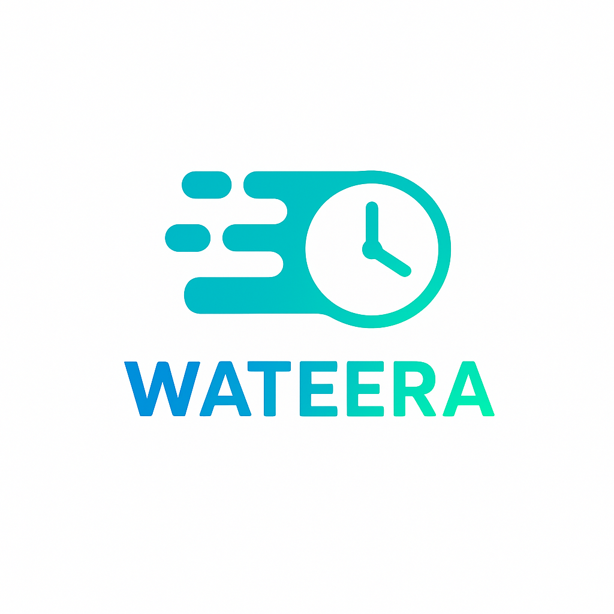

# wateera

A new Flutter project.
<p align="center">
  
</p>

<h1 align="center">🌿 Wateera — Your Daily Rhythm for Productivity</h1>


> A modern Flutter productivity app combining calendar, notes, Pomodoro timer, and AI — helping you stay focused and balanced.
# 🌿 Wateera — Your Daily Rhythm for Productivity

Wateera is a **modern productivity and daily planning app** that helps you stay focused, organized, and balanced.  
It combines your **calendar, notes, to-do list, Pomodoro timer, and AI assistant** in one simple and elegant experience.

---

## 🚀 Features

### 🗓 Calendar & Tasks
- Plan your days with a clean calendar interface.
- Add, edit, and delete tasks quickly.
- Visualize your daily goals in a timeline view.

### 📝 Notes
- Write and organize notes by day or topic.
- Color tagging for easy categorization.

### ⏱ Pomodoro Focus Timer
- Built-in focus timer with work/break intervals.
- Helps you stay productive without burnout.

### 🤖 AI Assistant
- Add or remove tasks using natural language.
- Example: *“Add study from 5 to 6 PM”* or *“Show my schedule for tomorrow.”*
- Smart suggestions to improve your workflow.

### ⚙️ Settings
- Light & dark mode.
- Customizable productivity preferences.
- Notification and focus reminder controls.

---

## 🎨 Design Language
- **Primary Colors:** Soft Purple `#8B5CF6` and Mint Green `#A7F3D0`
- Smooth animations, rounded cards, and minimalist Zen-inspired design.

---

## 🧠 Tech Stack

| Layer | Technology |
|-------|-------------|
| Framework | Flutter 3.24+ |
| Backend | Firebase Firestore |
| State Management | Provider |
| AI Integration | OpenAI API / Dialogflow |
| Notifications | flutter_local_notifications |
| UI Design | Material 3 + Google Fonts |

---

## 🏗 Project Structure

lib/
├─ models/
├─ services/
├─ providers/
├─ components/
├─ screens/
├─ theme/
└─ utils/


---

## ⚙️ Setup Instructions

1. Clone the repository  
   ```bash
   git clone https://github.com/soghayarmahmoud/wateera.git
2. Install dependencies
   ```bash
   flutter pub get
3. Run the app
     ```bash
   flutter run
📸 Preview

Screenshots and demo video coming soon.

🤝 Contributing

Contributions are welcome!
Feel free to fork the repo, open issues, and submit pull requests.

📄 License

This project is licensed under the MIT License —
you’re free to use, modify, and distribute it with attribution.

💬 About

Wateera helps you create balance —
not just to do more, but to live better and focus smarter.

“Productivity is not about being busy; it’s about being intentional.” 🌿

---

<p align="center">
  
</p>

<p align="center">
  <b>Wateera — Your Daily Rhythm for Productivity</b><br>
  Built with ❤️ using Flutter & Firebase By Mahmoud Elsoghayar 
</p>
